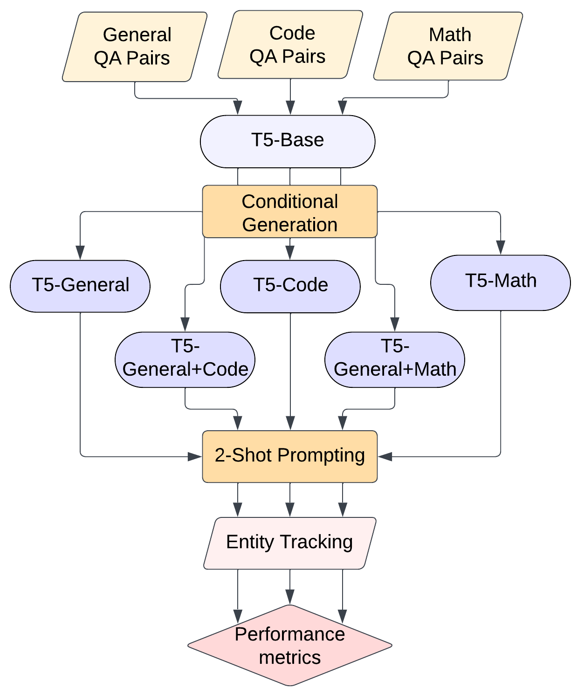

# MIT 6.8610 - Research Project

### **Team Members**  
+ Kimberly Llajaruna ([kllajarunaperalta@g.harvard.edu](mailto:kllajarunaperalta@g.harvard.edu))
+ Emilia Mazzolenis ([maria_mazzolenis@g.harvard.edu](mailto:maria_mazzolenis@g.harvard.edu))
+ Michael Sam ([msamchec@g.harvard.edu](mailto:msamchec@g.harvard.edu))
+ Clara Ye ([zixuanye@g.harvard.edu](mailto:zixuanye@g.harvard.edu))

# **Beyond Words: Reasoning in Entity Tracking**  

### **Introduction**

Entities, integral to the conveyance of meaning in natural language, evolve continuously and play a crucial role in information transmission. Named Entity Recognition (NER) is vital for locating and categorizing entities, but entity tracking goes further by tracing entity mentions over time, offering insights into temporal changes and narrative evolution. While entity tracking is fundamental in NLP, its complexity surpasses human-like tracking. Models need to accurately comprehend and connect diverse entity references for coherence and context, supporting tasks like summarization and machine translation. Unlike NER, entity tracking faces challenges requiring sophisticated algorithms and annotated datasets. Despite research showing that intermediate chain of thought prompts enhance language models' complex reasoning, the application of such reasoning in entity tracking remains understudied. There is significant potential for research to improve model performance in these tasks.

### **Methodology**

To comprehensively explore the impact of finetuning models equipped with reasoning capabilities, we aim to extend the existing literature. We specifically assess the effects of finetuning by integrating reasoning through two distinct avenues: mathematical reasoning— involving problems with mathematical questions and comprehensive step-by-step answers—, and computational reasoning— encompassing problems with coding-related questions and well-defined, step-by-step coding solutions. Employing a T5-base model across these scenarios, we establish a baseline by utilizing a model finetuning solely on factual information without any reasoning. Our evaluation criteria encompass accuracy and entity precision to gauge the performance of our models. The current work has the potential to inform the design of more effective models and enhance their performance across various applications.

Based on this model and with the previously defined 5 datasets, we decided to train  5 different models as per the graph below:
- T5-General
- T5-Code
- T5-Math
- T5-General+Code
- T5-General+Math




### Repository Structure
----------------------

```
.
├── data
│   ├── code                <- Folder with code QAs
│   │   ├── ...             
│   ├── general             <- Folder with general knowledge QAs
│   │   ├── ...             
│   └── math                <- Folder with math QAs
│       ├── ...                
├── eval                    <- Folder with the evaluation dataset
│   ├── current_use
│   │   ├── ...
│   └── few_shot_boxes_nso_exp2_max3
│       ├── ...
├── results
│   ├── eval
│       ├── plots           <- Folder with plots of the results of experiments 
│       │   ├── ...
│       └── preds           <- Folder with json files of the inference of experiments
│           ├── ...
├── 6_8610_Project_Proposal_ANNOTATED.pdf
├── README.md
├── reports                 <- Folder with images for ReadMe   
│   ├── ...
├── evaluation.ipynb        <- Notebook to evaluate the fine-tuned models
└── research_project.ipynb  <- Notebook for data preprocessing and fine-tuning

```
-----------------------


### How to run the code

The notebook detailing the preprocessing steps and model fine-tuning is available in **`research_project.ipynb`**. This notebook leverages three datasets: `data/code`, `data/general` and `data/math` to construct the fine-tuning sets.

Subsequently, the notebook responsible for evaluating the model on the test set and calculating metrics can be located in **`evaluation.ipynb`**. This notebook utilizes the evaluation dataset found in `eval` and stores generated plots and predictions in `results/eval/plots` and `results/eval/preds`, respectively.


### Paper

The final paper can be found [here.](https://github.com/Kimberly97llp/NLP_research/blob/main/6_8610_Final_Paper.pdf)